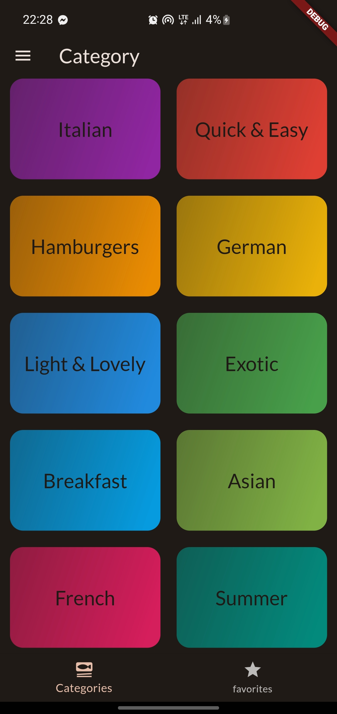
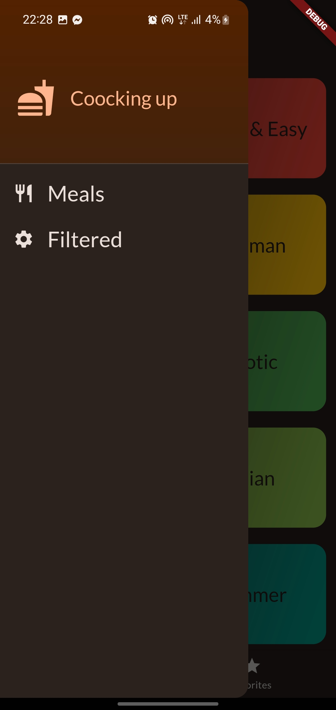
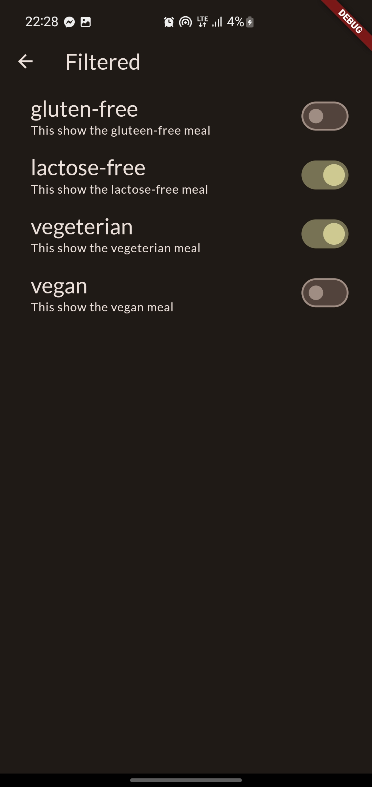
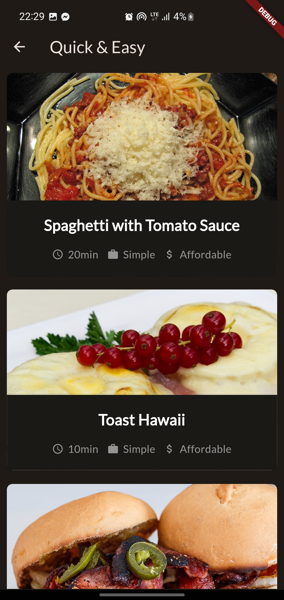
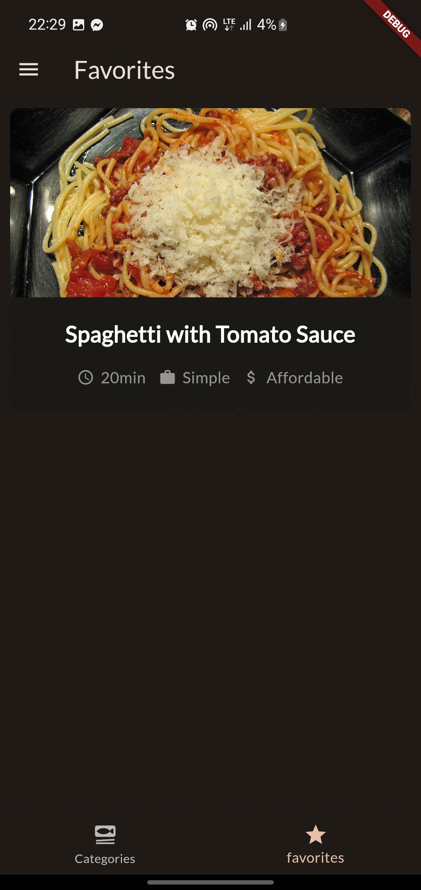
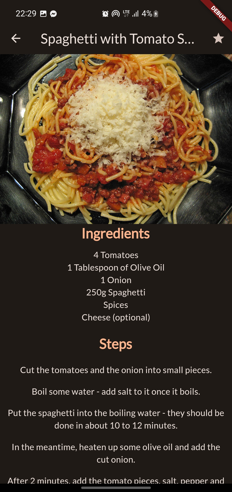

<h1>Meal App</h1>
    

<h1>Description</h1>

The Meal App is a mobile application built using Flutter and Riverpod. It provides users with a convenient way to discover and explore a variety of meals. Users can browse through categories, view meal details including ingredients and preparation steps, mark their favorite meals, and apply filters such as gluten-free, lactose-free, vegetarian, and vegan meals
<h1>Features</h1>
1-Category Selection: Users can start by selecting a meal category of their choice. 
2-Meal List: Within each category, users can view a list of meals. 
3-Meal Details: Users can access detailed information about each meal, including ingredients and preparation steps. 
4-Favorites: Users can add meals to their favorites list for quick access. 
5-Filters: Users can filter meals based on dietary preferences like gluten-free, lactose-free, vegetarian, and vegan options. 

<h1>Getting Started</h1>

Follow these steps to get the Meal App up and running on your local development environment: 

1-Clone the Repository 
2-Navigate to the Project Directory 
3-Install Dependencies 
4-Run the App 

<h1>Usage</h1>
1-Upon launching the app, you will be presented with a list of meal categories. 
2-Select a category to explore meals within that category. 
3-Click on a meal to view its details, including ingredients and preparation steps. 
4-Mark meals as favorites by clicking the heart icon. 
5-Use the filter options to narrow down meal choices based on dietary preferences. 

<h1>Screenshots</h1>

